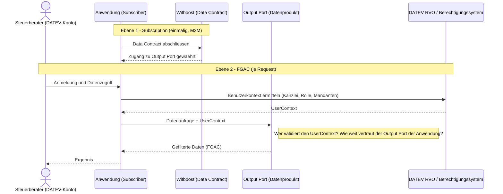

# ADR-TI-001: Tenant-Modell und Identitätsstruktur

| | |
|---|---|
| **Status** | DRAFT |
| **Version** | 1.0 |
| **Datum** | 09.03.2026 |
| **Autor** | Marcel Meyer / adorsys GmbH & Co. KG |
| **Kontext** | DATEV Data-Next Plattform – Handlungsfeld Datenplattform |
| **Verwandte ADRs** | ADR-TI-002 (FGAC), ADR-TI-003 (Datenprodukt-Governance) |

---

## 1. Problemstellung

Die DATEV Data-Next Plattform stellt Daten als semantische Datenprodukte bereit, die von verschiedenen Konsumentengruppen genutzt werden. Bevor eine Berechtigungsarchitektur entworfen werden kann, muss geklärt sein, was im Kontext dieser Plattform ein „Tenant" ist – und wie Identität und Kontext eines Benutzers zur Laufzeit aufgelöst werden.

Diese Frage ist nicht trivial: DATEV betreibt mehrere parallele Identitätssysteme, Kanzleien sind organisatorisch komplex strukturiert, und der Subscriber eines Datenprodukts ist nicht die Person, die auf die Daten zugreift. Ohne eine klare Tenant-Definition können Berechtigungsarchitektur, Isolation und Zugriffskontrolle nicht sinnvoll entworfen werden.

Bestehende Anwendungen lösen dieses Problem heute mit Ad-hoc-Ansätzen: GoodData nutzt einen Permission Sync Service, der das DATEV-Berechtigungssystem (RVO) abfragt und das Ergebnis über die GoodData API einspielt. Dieser Workaround zeigt, dass das Problem real und dringlich ist – und dass ohne eine strukturierte Plattformlösung jeder Workstream eigene, inkonsistente Lösungen entwickelt.

---

## 2. Wer ist ein Tenant?

Der Begriff „Tenant" ist im DATEV-Umfeld nicht eindeutig besetzt. Je nach Betrachtungsebene kommen unterschiedliche Einheiten als Tenant in Frage:

- **Kanzlei als Tenant:** Die Steuerkanzlei als organisatorische Einheit, die Daten im Auftrag ihrer Mandanten verwaltet. Dies ist die naheliegendste Interpretation, wird aber durch die Tatsache erschwert, dass eine Kanzlei bei DATEV mehrfach (je Rechtsform) registriert sein kann.
- **Anwendung als Tenant:** Die konsumierende Anwendung, die einen Data Contract abgeschlossen hat und prinzipiellen Zugang zum Output Port besitzt.
- **DATEV-Konto als Tenant:** Der einzelne Benutzer mit seinem DATEV-Konto, dessen Kontext den Datenzugriff bestimmt.

Diese drei Ebenen existieren gleichzeitig und sind nicht deckungsgleich. Die Festlegung, welche Ebene für Isolation und Zugriffssteuerung maßgeblich ist, ist Voraussetzung für alle weiteren Architekturentscheidungen.

---

## 3. Konsumentenstruktur und Subscriber-Modell

### 3.1 Wer abonniert ein Datenprodukt?

Subscriber eines Datenprodukts in Witboost sind nicht Endnutzer wie Steuerberater oder Mandanten, sondern die **Anwendungen**, über die diese Nutzer auf DATEV-Dienste zugreifen. Eine Anwendung schließt einen Data Contract mit dem Producer ab und erhält so prinzipiellen Zugriff auf den Output Port.

Diese Anwendungen sind typischerweise:

- Leistungserstellende DATEV-Anwendungen, über die Steuerberater mit Kanzlei- und Mandantendaten arbeiten
- Interne DATEV-Systeme und Analyseplattformen (z.B. für Data Scientists oder Reporting)
- Perspektivisch: Anwendungen, die Mandanten oder Unternehmen direkt Zugang zu ihren Daten ermöglichen

### 3.2 Subscriber ist nicht gleich Endbenutzer

Der Subscriber (Anwendung) und der Endbenutzer (Steuerberater mit DATEV-Konto) sind konzeptionell verschiedene Entitäten. Ein Mapping zwischen Witboost-Subscriber und DATEV-Identität ist daher nicht sinnvoll und technisch nicht möglich: Anwendungen haben kein DATEV-Konto.

Die eigentliche Herausforderung liegt eine Ebene tiefer: Wenn ein Endbenutzer über die Anwendung auf den Output Port zugreift, muss die Anwendung dessen **UserContext** (DATEV-Konto + aktive Kanzlei + Rolle) an den Output Port übermitteln. Wer diesen Kontext validiert und wie weit der Output Port der Anwendung vertraut, ist ungeklärt.

---

## 4. Identitätssysteme bei DATEV

DATEV betreibt aktuell zwei grundlegend unterschiedliche Identity-Systeme, die parallel existieren und nicht vollständig harmonisiert sind:

**Klassisches RZ-System (DataPower / ZID):**
- Identität ist direkt an eine Smartcard (ZID) gebunden
- Berechtigungen hängen physisch an der Karte
- Basis für den Großteil der bestehenden Kanzlei-Integrationen

**DATEV-Konto (Cloud / neue Welt):**
- Identität ist von Authentifizierungsmittel entkoppelt – die Smartcard fungiert nur noch als zweiter Faktor
- Selbstregistrierung möglich; Vertrauenslevel wird durch Nachweise erhöht
- Basis für Cloud-native Anwendungen; noch nicht flächendeckend ausgerollt
- Organisations- und Tenant-Kontext wird über das DATEV Organisationsmanagement (DGB) verwaltet

Für Datenprodukte im Kontext der neuen Plattform ist das DATEV-Konto das Zielbild. Zum aktuellen Zeitpunkt sind jedoch nicht alle konsumierenden Anwendungen auf dieses System migriert.

---

## 5. Kanzleistruktur und Kontext-Komplexität

Die Tenantstruktur bei DATEV ist mehrschichtig. Typische Komplexitäten:

- Eine Kanzlei kann bei DATEV mehrfach registriert sein – einmal je Rechtsform
- Eine Kanzlei besteht aus mehreren Gesellschaftern und Mitarbeitern mit unterschiedlichen Rollen
- Ein einzelner Steuerberater kann gleichzeitig für mehrere Kanzleien tätig sein – beim Datenzugriff ist unklar, in welchem Kanzlei-Kontext er gerade agiert
- Mandanten sind keine direkten Nutzer, aber Kanzleien unterteilen ihre Datentöpfe nach Mandanten

Das DATEV-Konto allein identifiziert eine Person, aber nicht den **aktiven Kontext**. Erst die Kombination aus DATEV-Konto und **Kontext-Entität** (für welche Kanzlei agiere ich gerade, in welcher Rolle) ermöglicht eine kontextscharfe Berechtigungsentscheidung.

---

## 6. Offene Entscheidungsfragen

| # | Entscheidungsfrage | Verantwortlich |
|---|---|---|
| 1 | Was ist ein Tenant im Kontext der Data-Next Plattform – Kanzlei, Anwendung oder DATEV-Konto? Welche Ebene ist für Isolation und Zugriffssteuerung maßgeblich? | EAM + Data Governance |
| 2 | Welches Identity-System ist das Zielbild für externe Konsumenten? Wie wird der Übergang von RZ-Identitäten zu DATEV-Konto gehandhabt? | IAM + Data Governance |
| 3 | Wie wird der Tenant-Kontext (aktive Kanzlei) bei einem Benutzer ermittelt, der für mehrere Kanzleien tätig ist? | IAM + Solution Architect |
| 4 | Wie wird der UserContext (DATEV-Konto + Kontext-Entität) von der Subscriber-Anwendung an den Output Port übermittelt, und wer stellt sicher, dass dieser Kontext valide und nicht manipulierbar ist? | Solution Architect + IAM + Platform Team |
| 5 | Ist die Kontext-Entität (aktive Kanzlei + Rolle) ein Pflichtbestandteil des Tokens, oder ein optionaler Zusatz? | IAM + EAM |

---

## 7. Randbedingungen für den Lösungsraum

Folgende Randbedingungen ergeben sich zwingend aus dem beschriebenen Problemraum. Jede Lösungsarchitektur muss sie erfüllen oder eine begründete Ausnahme dokumentieren.

**RB-TI-001-F1 – Tenant-Ebene muss explizit definiert sein**
Eine Lösung darf nicht implizit eine Tenant-Ebene voraussetzen. Die maßgebliche Ebene (Kanzlei, Anwendung oder DATEV-Konto) muss vor Implementierungsbeginn explizit entschieden sein.

**RB-TI-001-F2 – Subscriber und Endbenutzer sind getrennt zu behandeln**
Eine Lösung muss Subscription (M2M, Anwendung) und Benutzerzugriff (FGAC, DATEV-Konto) konzeptionell und technisch getrennt behandeln. Beide Ebenen dürfen nicht in einem einzigen Mechanismus vermischt werden.

**RB-TI-001-F3 – Kein Identity-System darf vorausgesetzt werden**
Eine Lösung muss mit beiden parallelen Identity-Systemen (RZ/ZID und DATEV-Konto) umgehen können oder den Migrationspfad explizit adressieren. Sie darf nicht ausschließlich auf ein einziges System aufbauen.

**RB-TI-001-F4 – Kontext-Entität ist Pflicht**
Eine Lösung muss die Kontext-Entität (aktive Kanzlei + Rolle) als Pflichtbestandteil des Zugriffskontexts behandeln. Das DATEV-Konto allein ist keine ausreichende Grundlage für eine Berechtigungsentscheidung.

**RB-TI-001-F5 – Mehrfache Kanzleizugehörigkeit muss auflösbar sein**
Eine Lösung muss den Fall handhaben, dass ein Benutzer für mehrere Kanzleien tätig ist. Der aktive Kanzlei-Kontext muss je Request eindeutig bestimmt sein – nicht je Session.

**RB-TI-001-S1 – UserContext muss validierbar sein**
Eine Lösung sollte sicherstellen, dass der von einer Anwendung übermittelte UserContext validiert wird. Eine Anwendung darf nicht ungeprüft einen beliebigen Kontext behaupten können.

---

## 8. Abgrenzung

Dieses ADR behandelt ausschließlich die Fragen der Tenant-Definition, Identitätsstruktur und des Subscriber-Modells. Fragen zur Berechtigungslogik, FGAC-Durchsetzung und Technologievarianten sind Gegenstand von ADR-TI-002. Fragen zur Ownership und Governance von Berechtigungsregeln im Data-Mesh-Kontext sind Gegenstand von ADR-TI-003.

---

*ADR-TI-001 · DATEV Data-Next Plattform · Stand: 09.03.2026 · Status: DRAFT · Version 1.0*
