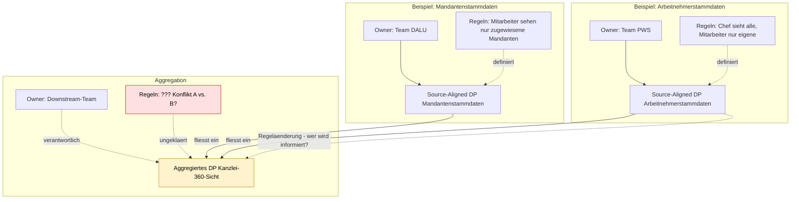

# ADR-TI-003: Datenprodukt-Ownership und Berechtigungsgovernance im Data Mesh

| | |
|---|---|
| **Status** | DRAFT |
| **Version** | 1.0 |
| **Datum** | 09.03.2026 |
| **Autor** | Marcel Meyer / adorsys GmbH & Co. KG |
| **Kontext** | DATEV Data-Next Plattform – Handlungsfeld Datenplattform |
| **Verwandte ADRs** | ADR-TI-001 (Tenant-Modell), ADR-TI-002 (FGAC) |

---

## 1. Problemstellung

ADR-TI-002 beschreibt, wie FGAC technisch durchgesetzt werden kann. Dieses ADR adressiert eine vorgelagerte Frage: Wer definiert und verantwortet die Berechtigungsregeln in einem föderierten Data-Mesh-Modell – und wie funktioniert das, wenn Datenprodukte verschiedener Domänen kombiniert werden?

Im Data-Mesh-Ansatz liegt die Verantwortung für Daten beim jeweiligen Domain-Team. Für Berechtigungsregeln ist diese Zuordnung jedoch nicht eindeutig: Ein Data Product Owner kennt seine Daten, aber nicht den Benutzerkontext des Konsumenten. Die konsumierende Anwendung kennt den Benutzerkontext, aber nicht die fachlichen Regeln des Produzenten. Beide Seiten sind für eine vollständige Berechtigungsentscheidung notwendig.

Dieses Problem verschärft sich bei aggregierten Datenprodukten, die Daten aus mehreren Domänen zusammenführen – und bei Consumer-Aligned Datenprodukten, die implizite Isolationsannahmen tragen.

---

## 2. Datenprodukt-Typen und ihre Governance-Implikationen

Nicht alle Datenprodukte stellen dieselben Anforderungen an Berechtigungsgovernance:

**Source-Aligned DP:**
Bildet eine fachliche Domäne ab. Berechtigungsregeln sind domänenspezifisch und werden vom jeweiligen Owner definiert. Die Verantwortung ist klar – der Domain-Owner ist zuständig.

**Aggregiertes DP:**
Führt mehrere Source-Aligned DPs zusammen. Berechtigungsregeln müssen aus mehreren Domänen kombiniert werden. Die Ownership-Frage ist nicht eindeutig – und die Regeln der einbezogenen Sources können sich widersprechen.

**Consumer-Aligned DP:**
Ist explizit für einen einzigen Konsumenten zugeschnitten. Die Isolationsannahme ist implizit durch den Zuschnitt gegeben – trägt aber ein besonderes Risiko wenn das DP nachträglich geöffnet wird.

---

## 3. Ownership bei aggregierten Datenprodukten

### 3.1 Das Ownership-Vakuum

Ein aggregiertes Datenprodukt führt Daten aus mehreren Source-Aligned DPs zusammen, die jeweils eigene Owner haben. Daraus entstehen strukturelle Probleme:

- Der Owner eines Source-Aligned DP hat keinen Überblick darüber, in welche aggregierten DPs seine Daten einfließen – er kann keine Berechtigungsregeln für Kontexte definieren, die er nicht kennt
- Der Owner des aggregierten DP kennt die fachlichen Regeln der einbezogenen Quelldatenprodukte möglicherweise nicht vollständig
- Änderungen an Berechtigungsregeln eines Source-Aligned DP werden nicht automatisch auf abhängige aggregierte DPs propagiert

### 3.2 DDD-Perspektive: Upstream/Downstream Verantwortung *(Vorschlag Mario Bender)*

> Mario Bender schlägt vor, die Ownership-Frage analog zu DDD Bounded Context Beziehungen zu betrachten.

Source-Aligned DPs agieren als **Upstream** – sie liefern und sind unabhängig. Das aggregierte DP ist **Downstream** – es empfängt und ist abhängig. Der Downstream-Workstream ist damit Owner des aggregierten Datenprodukts. Welchen Handlungsspielraum er bei Berechtigungsregeln hat, wird durch das gewählte **Relationship Pattern** bestimmt:

| Pattern | Beschreibung | Implikation für Berechtigungsregeln |
|---|---|---|
| **Customer/Supplier** | Upstream arbeitet mit dem Downstream zusammen, Anforderungen werden priorisiert eingebaut | Regeländerungen werden koordiniert – Downstream kann Anforderungen einbringen |
| **Conformist** | Downstream muss nehmen was da ist, hat keinen Einfluss auf das Source-Aligned DP | Berechtigungsregeln des Upstream werden übernommen wie sie sind – keine Verhandlung möglich |
| **Anti-Corruption Layer** | Downstream fügt einen Adapter ein, weil das Source-Aligned DP schlechte oder wechselnde Qualität hat | Downstream kapselt und übersetzt Berechtigungsregeln eigenständig – höherer Aufwand, aber mehr Kontrolle |
| **Open Host Service** | Upstream exponiert einen offenen Standard, den Downstream implementiert | Upstream definiert ein standardisiertes Berechtigungsmodell – Downstream implementiert es |

Für die Data-Next Plattform ist noch nicht entschieden, welches Pattern zwischen Source-Aligned und aggregierten DPs gilt – oder ob das Pattern pro Datenprodukt-Kombination individuell festgelegt wird.

### 3.3 Regelkonflikte

Wenn mehrere Source-Aligned DPs mit unterschiedlichen Berechtigungsmodellen zusammengeführt werden, entstehen Konflikte ohne definierten Lösungsmechanismus:

- Quelle A erlaubt Mitarbeitern den Zugriff auf alle Datensätze ihrer Kanzlei; Quelle B schränkt den Zugriff auf zugewiesene Mandanten ein – welche Regel gilt im aggregierten Kontext?
- Berechtigungsregeln die auf Ebene einzelner Domänen sinnvoll sind, können in domänenübergreifenden Aggregationen zu unerwarteten Kombinationseffekten führen, die keiner der beteiligten Owner allein verantworten kann

---

## 4. Sonderfall: Consumer-Aligned DP

Consumer-Aligned DPs existieren nicht für einen allgemeinen Zweck, sondern sind explizit auf einen einzigen Konsumenten zugeschnitten. Das verschiebt die Machtbalance im Relationship Pattern erheblich.

**Ownership:** Das erstellende Team ist formal Owner. Faktisch bestimmt der Konsument die Anforderungen – das Pattern nähert sich einem **Customer/Supplier** oder geht weiter in Richtung **Published Language**.

**Vereinfachungspotenzial:** Da das DP per Definition nur für einen Konsumenten existiert, könnte FGAC auf Plattformebene vereinfacht oder vermieden werden – die Isolation ist durch den Zuschnitt implizit gegeben. Das gilt jedoch nur wenn:
- Ausschließlich der vorgesehene Konsument Zugriff auf den Output Port hat
- Das DP nicht nachträglich für weitere Konsumenten geöffnet wird
- Der Konsument selbst sicherstellt, dass seine Benutzer nur die für sie bestimmten Daten sehen

**Risiko:** Sobald ein Consumer-Aligned DP nachträglich für weitere Konsumenten geöffnet wird, bricht die implizite Isolationsannahme sofort – ohne dass ein expliziter Schutz greift. Es braucht einen Mechanismus, der diese unbeabsichtigte Öffnung verhindert oder erkennt.

---

## 5. Offene Entscheidungsfragen

| # | Entscheidungsfrage | Verantwortlich |
|---|---|---|
| 1 | Wer ist verantwortlich für die Definition von FGAC-Regeln in einem Data-Mesh – jede Domäne eigenständig, zentral koordiniert, oder geteilt zwischen Producer und Consumer? | Data Governance + Workstream Architect |
| 2 | Welches DDD Relationship Pattern gilt zwischen Source-Aligned und aggregierten Datenprodukten – und wer legt das fest? Gilt ein einheitliches Pattern oder wird es pro Datenprodukt-Kombination individuell entschieden? | Data Governance + EAM + Workstream Architect |
| 3 | Wie werden Regelkonflikte zwischen Source-Aligned DPs in einem aggregierten DP aufgelöst – und wer hat die Entscheidungshoheit? | Data Governance + Data Product Owner |
| 4 | Wie werden Änderungen an Berechtigungsregeln eines Source-Aligned DP auf alle abhängigen aggregierten Datenprodukte propagiert und kommuniziert? | Platform Team + Data Product Owner |
| 5 | Unter welchen Bedingungen darf ein Consumer-Aligned DP auf weitere Konsumenten ausgeweitet werden, und welcher Mechanismus verhindert dass die implizite Isolationsannahme unbemerkt bricht? | Platform Team + Data Product Owner |

---

## 6. Randbedingungen für den Lösungsraum

**RB-TI-003-F1 – Ownership muss explizit sein**
Jedes Datenprodukt – Source-Aligned, aggregiert und Consumer-Aligned – muss einen eindeutig definierten Owner haben. Ownership-Vakuum ist kein akzeptabler Zustand.

**RB-TI-003-F2 – Relationship Pattern muss entschieden sein**
Bevor ein aggregiertes Datenprodukt in Betrieb geht, muss das Relationship Pattern zwischen Upstream und Downstream explizit festgelegt sein. Das Pattern bestimmt den Handlungsspielraum des Downstream-Teams bei Berechtigungsregeln.

**RB-TI-003-F3 – Regelkonflikte müssen auflösbar sein**
Eine Lösung muss einen definierten Mechanismus für Regelkonflikte zwischen Source-Aligned DPs bereitstellen. Stilles Priorisieren einer Regel ist nicht akzeptabel.

**RB-TI-003-F4 – Regeländerungen müssen propagierbar sein**
Wenn ein Source-Aligned DP seine Berechtigungsregeln ändert, müssen alle abhängigen aggregierten DPs informiert oder automatisch aktualisiert werden. Veraltete Regelstände in downstream DPs sind nicht akzeptabel.

**RB-TI-003-F5 – Consumer-Aligned DPs brauchen einen Öffnungsschutz**
Eine Lösung muss sicherstellen, dass Consumer-Aligned DPs nicht ohne explizite Governance-Entscheidung und Berechtigungsprüfung für weitere Konsumenten geöffnet werden können.

**RB-TI-003-S1 – Föderierte Governance muss skalierbar sein**
Eine Lösung sollte so gestaltet sein, dass Domain-Teams Berechtigungsregeln eigenständig definieren und pflegen können, ohne für jeden Regeländerungs-Wunsch eine zentrale Instanz einzuschalten.

---

## 7. Abgrenzung

Dieses ADR behandelt ausschließlich Governance-Fragen zu Ownership, Relationship Patterns und Regelverantwortung im Data-Mesh-Kontext. Fragen zur technischen Durchsetzung von FGAC sind Gegenstand von ADR-TI-002. Fragen zur Tenant-Definition und Identitätsstruktur sind Gegenstand von ADR-TI-001.

---

*ADR-TI-003 · DATEV Data-Next Plattform · Stand: 09.03.2026 · Status: DRAFT · Version 1.0*
